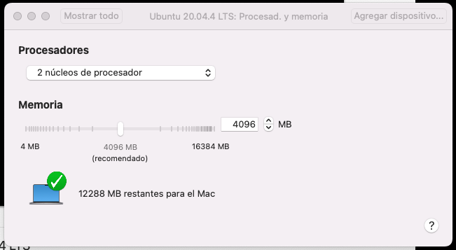

## Description
Install Ubuntu VM on mac M1

## Steps to follow

- **Step 01:** 
Install [VMware Fusion for MAC M1 architecture](https://www.vmware.com/es/products/fusion.html)

- **Step 02:** 
Download [Ubuntu 20.04 LTS (Ubuntu ubuntu-20.04.4 ARM Server)](https://ubuntu.com/download/server/arm). For now not exist any Ubuntu Desktop prepared for Mac ARM Silicon, so we must install previously this server version and later install Gnome Desktop

- **Step03:** 
Create a VM from VMWare Fusion for our iso image download. Select memory, CPU and hard disk space

