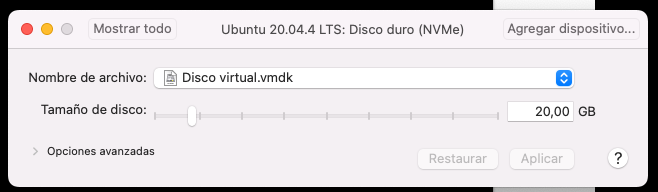
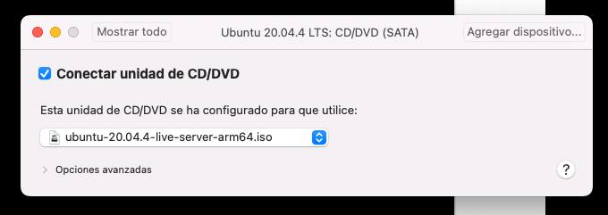

## Description
Install Ubuntu VM on mac M1

## Steps to follow

- **Step 01:**<br>
Install [VMware Fusion for MAC M1 architecture](https://www.vmware.com/es/products/fusion.html)

more information about Ubuntu and MAC M1 silicon could be read from this [link](https://communities.vmware.com/t5/Fusion-for-Apple-Silicon-Tech/Tips-Techniques-Gotchas-for-the-Tech-Preview/ta-p/2893986?attachment-id=108286) and [this one](https://gist.github.com/rhaleblian/44f2cb4418ee978603dc0b15dadf0e02)

- **Step 02:**<br>
Download [Ubuntu 20.04 LTS (Ubuntu ubuntu-20.04.4 ARM Server)](https://ubuntu.com/download/server/arm). For now not exist any Ubuntu Desktop prepared for Mac ARM Silicon, so we must install previously this server version and later install Gnome Desktop

- **Step03:**<br>
Create a VM from VMWare Fusion for our iso image download. Select memory, CPU and hard disk space




- **Step04:**<br>
Attach the iso to CD/DVD device and Connect it



- **Step05:**<br>
One important it's deactivate the net adapter during the installation because if not the last kernel will installed and your vm will not run, so we must install the kernel that exist in the iso and not the last one. Later we could connect again to install the desktop


- **Step06:**<br>
Start the vm and install the Ubuntu 20.04 server. We must select the server name default user and password, keyboard language and hard disk. Finally the iso device will unattached and wen start we must deactivate the CD/DVD device and select the hard disk like default one to start our new vm installed. Also we must to activate the net adapter again.

- **Step07:**<br>
After start our vm we install the Desktop

```sh
sudo apt-get update
sudo apt install ubuntu-desktop
```
- **Step08:**<br>
Other tools could be ifconfig and Chromium because Google Chrome not exist yet for ubuntu arm architecture

```sh
sudo apt install net-tools
sudo apt install chromium-browser
```
